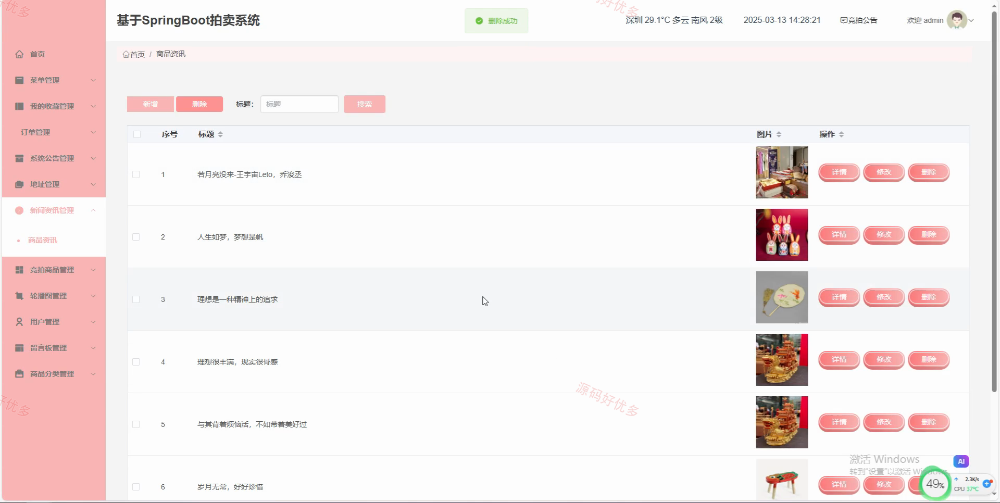
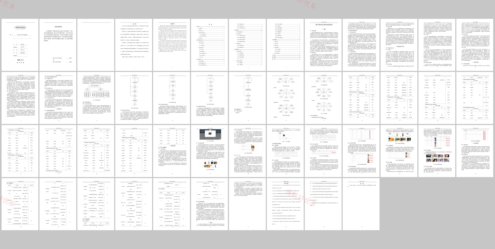

# springbootA555D
基于SpringBoot的拍卖系统
## 源码问题查看主页咨询

### 一、关键词
SpringBoot拍卖系统、竞拍商品、在线出价、订单管理、后台管理

### 二、作品包含
源码+数据库+万字设计文档+全套环境和工具资源+本地部署教程

### 三、项目技术
前端技术： Html、Css、Js、Vue3.2、Element-Plus
后端技术：Java、SpringBoot3.3.0、MyBatis-Plus

### 四、运行环境（以下版本亲测，其他版本兼容性请自行测试）
开发工具：IDEA/eclipse + VSCODE

数据库：MySQL5.7+（共16张表）

数据库管理工具：Navicat10以上版本

环境配置软件： JDK1.8 + Maven3.6.3

前端Nodejs：16+

浏览器：谷歌浏览器

### 五、项目介绍
项目编号：springbootA555D

基于SpringBoot的拍卖系统围绕竞拍商品发布、用户在线出价、订单流转和后台维护展开，支持用户浏览拍卖商品、参与竞价、管理地址和查看订单，管理员可维护商品、公告、订单和用户数据。

角色：管理员、用户

用户功能：注册登录、竞拍商品浏览、在线出价、订单查看、收货地址、留言反馈、个人中心。

管理员功能：用户管理、商品分类管理、竞拍商品管理、出价记录查看、订单管理、商品资讯、竞拍公告、轮播图配置。

### 六、运行截图

